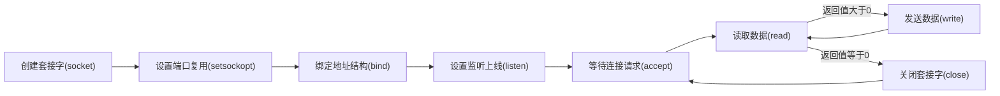

## 代码流程图

- 服务器



创建套接字=>设置端口复用(可选)=>绑定地址结构=>设置监听上限=>等待客户端连接=>等待客户端消息=>回传客户端消息

- 客户端

  ```mermaid
  graph LR
      socket[创建套接字&#40socket&#41]
      connect[连接服务器&#40connect&#41]
      read[读取数据&#40read&#41]
      write[发送数据&#40write&#41]
      scanf[输入数据&#40scanf&#41]
      socket --> connect --> scanf -->write --> read --> scanf
  
         
  ```

  创建套接字=>连接服务器=>等待用户输入数据=>发送用户输入数据=>读取服务器数据

## 函数API

### socket

~~~c
int socket(int domain, int type, int protocol);
~~~

#### 描述

- `socket` 函数用于创建一个套接字（socket）,它是网络通信中的基本构建块,允许不同计算机之间进行数据传输

#### 参数

- `domain`：地址族,`AF_INET` 表示IPv4地址族,`AF_INET6` 表示IPv6地址族

- `type`：套接字类型,`SOCK_STREAM`面向连接的流套接字(TCP),`SOCK_DGRAM`无连接的数据报套接字(UDP)

- `protocol`：协议,通常为0,表示系统会根据 `domain` 和 `type` 自动选择合适的协议,如TCP或UDP

#### 返回值

- 成功时,返回新创建的套接字的文件描述符（非负整数）
- 失败时,返回 -1,并设置 `errno` 来指示错误类型

---

### setsockopt

```c
int setsockopt(int sockfd,int level,int optname,const void *optval,socklen_t optlen);
```

#### 描述

- `setsockopt` 函数用于设置套接字选项,允许你配置套接字的行为和属性

#### 参数

- `sockfd`：套接字描述符,指定要设置选项的套接字
- `level`：选项级别,通常使用 `SOL_SOCKET` 表示通用套接字选项也可以是其他协议特定的级别
- `optname`：选项名称,指定要设置的具体选项,如 `SO_REUSEADDR` 表示允许地址重用
- `optval`：选项值的指针,指向一个存储选项值的缓冲区,具体类型和长度取决于选项的类型
- `optlen`：选项值的长度,表示 `optval` 缓冲区的大小

#### 返回值

- 成功时,返回 0
- 失败时,返回 -1,并设置 `errno` 来指示错误类型

---

### bind

```c
int bind(int sockfd,const struct sockaddr *addr,socklen_t addrlen);
```

#### 描述

- `bind` 函数用于将套接字与特定的本地地址绑定,使得其他计算机可以通过该地址与套接字进行通信

#### 参数

- `sockfd`：套接字描述符,指定要绑定的套接字
- `addr`：地址结构体指针,指向一个存储本地地址信息的结构体,例如 `struct sockaddr_in` 用于IPv4
- `addrlen`：地址结构体长度,表示 `addr` 结构体的大小

#### 返回值

- 成功时,返回 0
- 失败时,返回 -1,并设置 `errno` 来指示错误类型

---

### listen

```c
int listen(int sockfd,int backlog);
```

#### 描述

- `listen` 函数将套接字置于监听状态,等待其他计算机的连接请求对于流套接字（如TCP套接字）,`listen` 函数将创建一个等待连接的队列,可以排队等待处理的连接请求的数量由 `backlog` 参数指定

#### 参数

- `sockfd`：套接字描述符,指定要进入监听状态的套接字
- `backlog`：等待连接队列的最大长度,通常是一个正整数

#### 返回值

- 成功时,返回 0
- 失败时,返回 -1,并设置 `errno` 来指示错误类型

---

### accept

~~~c
int accept(int sockfd,struct sockaddr *addr,socklen_t *addrlen);
~~~

#### 描述

- `accept` 函数用于接受连接请求,创建一个新的套接字来与客户端进行通信它在服务端程序中使用,用于接受流套接字（如TCP套接字）的连接

#### 参数

- `sockfd`：套接字描述符,指定要监听的套接字
- `addr`：客户端地址结构体指针,用于存储客户端的地址信息
- `addrlen`：客户端地址结构体长度的指针,表示 `addr` 结构体的大小

#### 返回值

- 成功时,返回新创建的与客户端通信的套接字描述符
- 失败时,返回 -1,并设置 `errno` 来指示错误类型

---